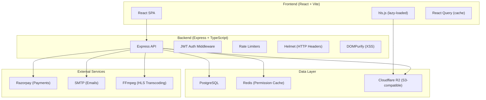
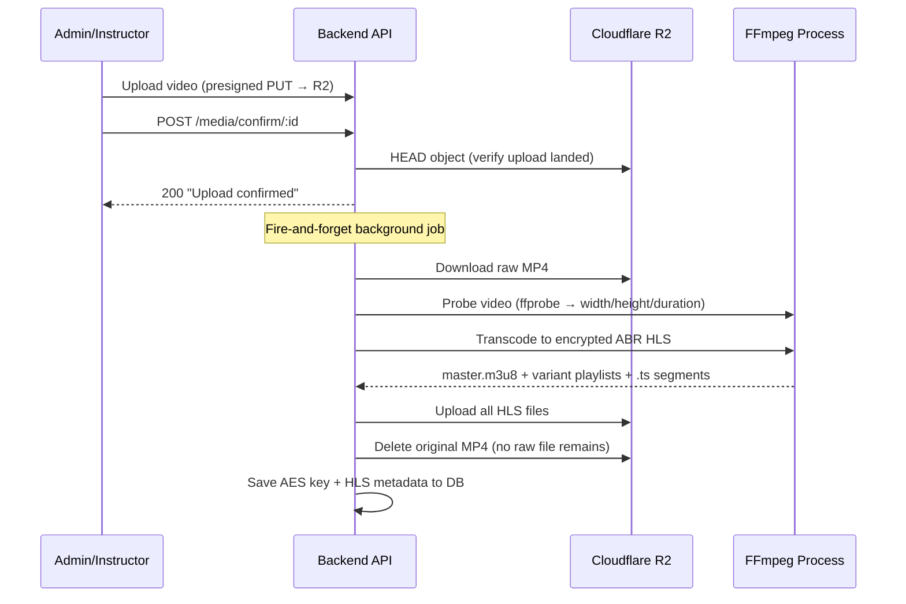
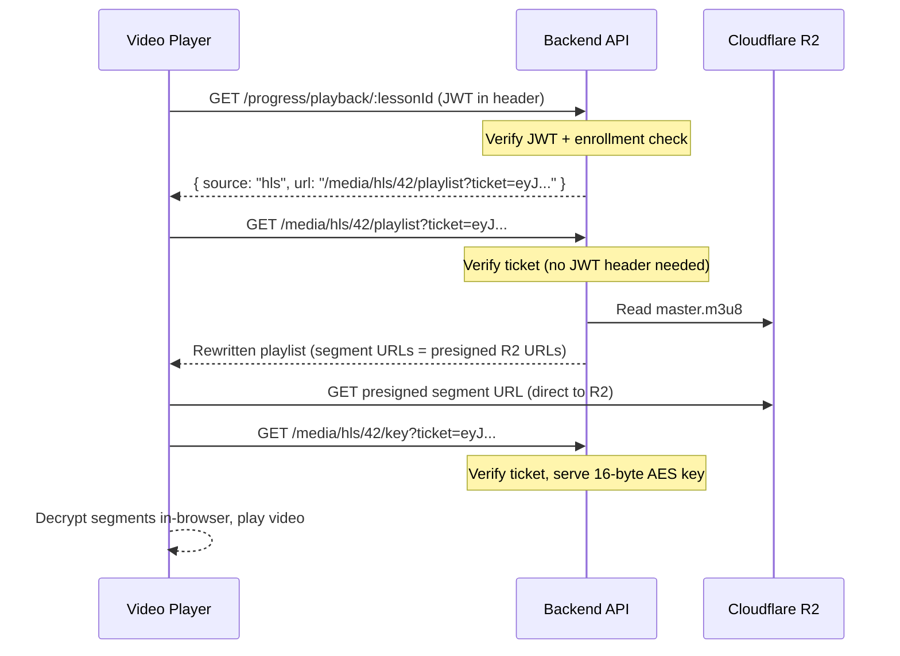
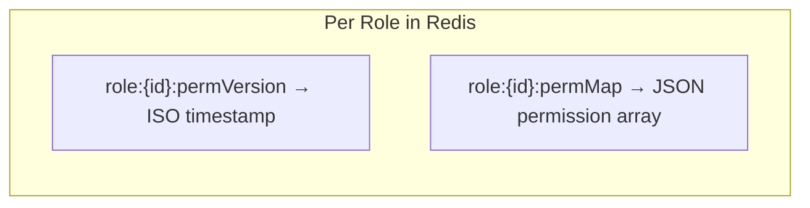
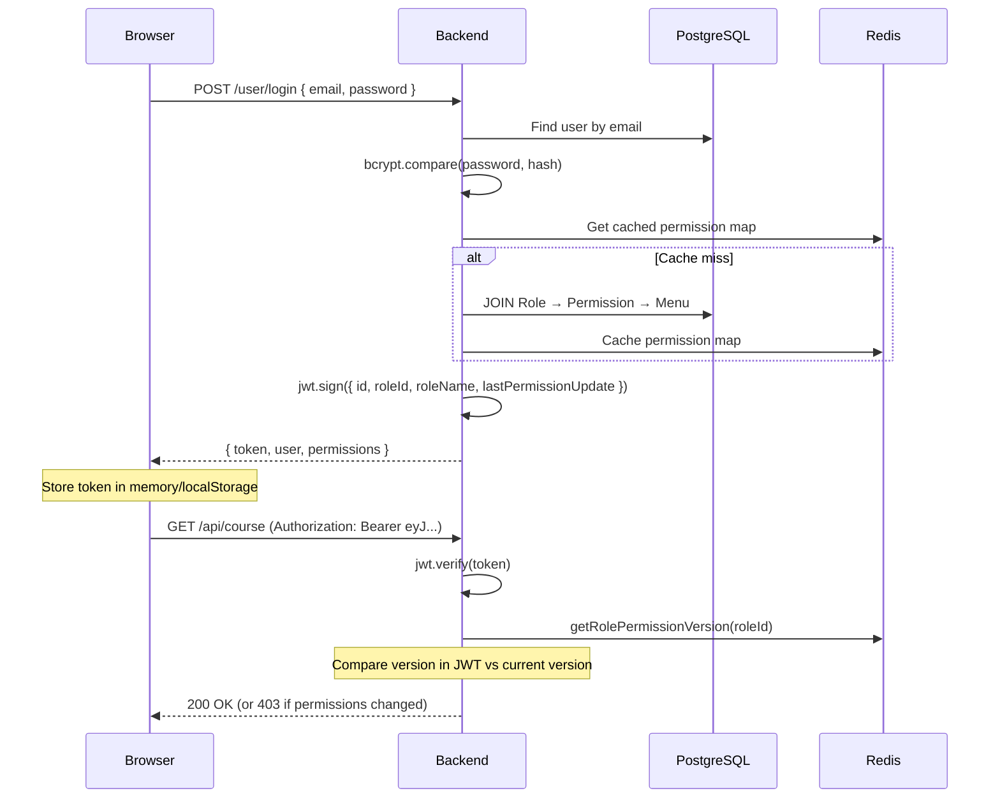
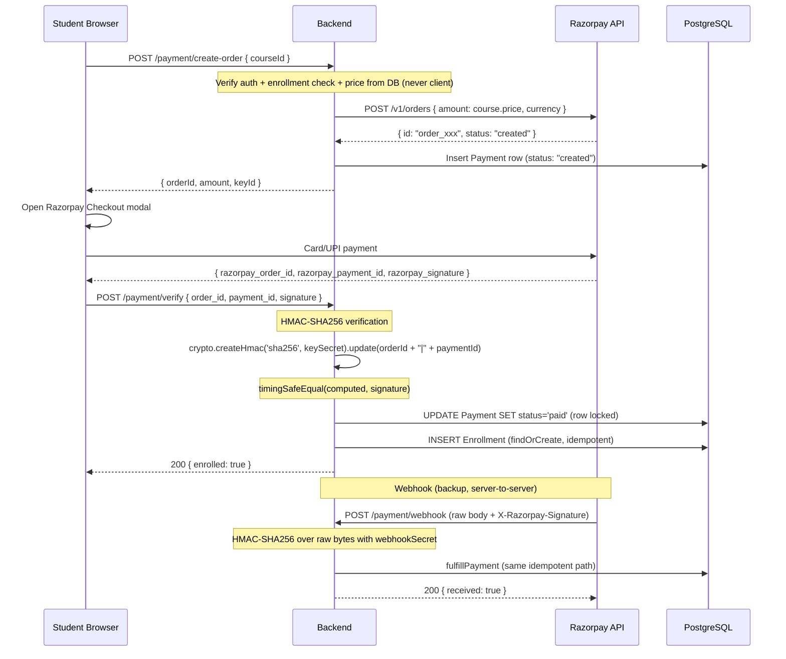
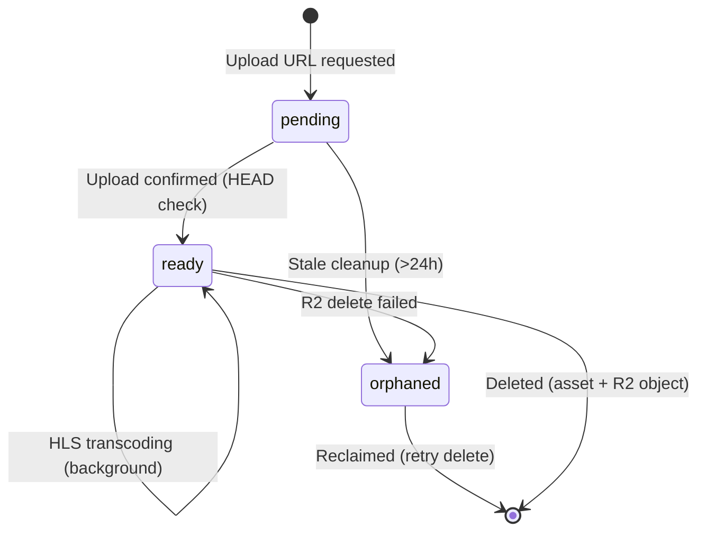
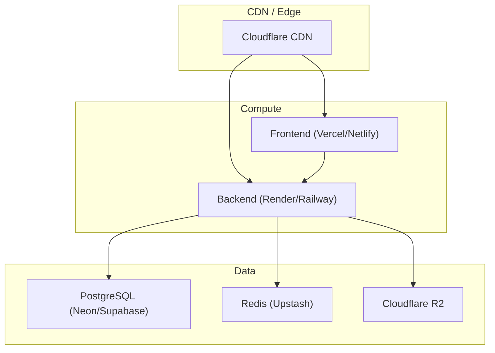

# VeoLMS — Complete Technical Deep Dive

> This document explains **every major system** in the VeoLMS codebase in detail: what it does, why it was designed that way, and exactly how the code implements it. Use this to prepare for the interview discussion.

---

## Table of Contents

1. [Architecture Overview](#1-architecture-overview)
2. [HLS Video Streaming Pipeline](#2-hls-video-streaming-pipeline)
3. [Secure Video Delivery (Ticket System)](#3-secure-video-delivery-ticket-system)
4. [Custom Video Player (Frontend)](#4-custom-video-player-frontend)
5. [Redis — Role & Permission Caching](#5-redis--role--permission-caching)
6. [Authentication & Authorization](#6-authentication--authorization)
7. [Payment Flow (Razorpay)](#7-payment-flow-razorpay)
8. [Cloud Storage (Cloudflare R2)](#8-cloud-storage-cloudflare-r2)
9. [Security Architecture (Defense in Depth)](#9-security-architecture-defense-in-depth)
10. [Database Design (PostgreSQL + Sequelize)](#10-database-design-postgresql--sequelize)
11. [Media Asset Lifecycle](#11-media-asset-lifecycle)
12. [Progress Tracking & Resume Playback](#12-progress-tracking--resume-playback)
13. [Input Sanitization (XSS Prevention)](#13-input-sanitization-xss-prevention)
14. [Error Handling Strategy](#14-error-handling-strategy)
15. [Cost Optimization Decisions](#15-cost-optimization-decisions)
16. [Deployment Architecture](#16-deployment-architecture)

---

## 1. Architecture Overview



### Tech Stack Summary

| Layer | Technology | Why |
|-------|-----------|-----|
| Frontend | React 19 + Vite 8 + TypeScript | Fast dev experience, modern React features |
| Styling | Tailwind CSS v4 + custom "Campus" theme | Utility-first with a branded neo-brutalist design system |
| State/Cache | TanStack React Query | Server-state cache, deduplication, background refetching |
| Backend | Express 5 + TypeScript | Mature, minimal, full control over middleware stack |
| Database | PostgreSQL + Sequelize 6 | Relational integrity for financial/enrollment data |
| Cache | Redis (ioredis) | Sub-ms permission lookups on every authenticated request |
| Storage | Cloudflare R2 (via AWS SDK) | S3-compatible, zero egress fees |
| Payments | Razorpay REST API (no SDK) | Lean dependency surface, full control over signature verification |
| Video | FFmpeg → AES-128 encrypted HLS | Adaptive bitrate, DRM-lite content protection |
| Security | Helmet, express-rate-limit, DOMPurify, bcryptjs | Defense in depth at every layer |

---

## 2. HLS Video Streaming Pipeline

### What is HLS?

**HTTP Live Streaming (HLS)** is Apple's adaptive-bitrate streaming protocol. Instead of serving one large MP4 file, HLS splits a video into small `.ts` segments (typically 6 seconds each) listed in `.m3u8` playlists. The player downloads segments one at a time, so:

- The user can **start watching immediately** (no full download needed)
- The player can **switch quality** mid-stream based on network conditions
- The video can be **encrypted segment-by-segment** (AES-128)

### How VeoLMS Implements It

The entire pipeline is in [hls-service.ts](file:///d:/veolms/backend/src/services/hls-service.ts).

#### Step-by-Step Flow



#### The Adaptive Bitrate Ladder

The system generates **multiple quality renditions** based on the source resolution. If a user uploads a 1080p video, they get 4 renditions. A 480p source only gets 2:

```typescript
const LADDER = [
  { h: 360,  vb: '800k',  ab: '96k'  },   // Low quality
  { h: 480,  vb: '1400k', ab: '128k' },   // Medium
  { h: 720,  vb: '2800k', ab: '128k' },   // HD
  { h: 1080, vb: '5000k', ab: '192k' },   // Full HD
];
```

**Why filter by source height?** Upscaling a 480p video to 1080p wastes storage/bandwidth and looks worse than the native resolution. The code only includes rungs ≤ the source:

```typescript
let rungs = LADDER.filter((r) => r.h <= height);
if (rungs.length === 0) rungs = [LADDER[0]]; // Always at least one
```

#### AES-128 Encryption

Every segment is encrypted with a random 16-byte AES-128 key generated per-asset:

```typescript
const key = randomBytes(16);
await writeFile(join(dir, 'enc.key'), key);
await writeFile(
  join(dir, 'key_info'),
  `veo-key\nenc.key\n${randomBytes(16).toString('hex')}\n`
);
```

The `key_info` file tells FFmpeg:
1. The key URI to embed in the playlist (a placeholder, rewritten at serve time)
2. The path to the actual key file
3. A random IV (initialization vector) for the encryption

After transcoding, the **key is saved to the database** (base64-encoded on the `MediaAsset` row) and the raw MP4 is **deleted from R2**. This means:
- There is no single downloadable file in storage
- The only way to get the key is through the gated API endpoint
- Each segment is individually encrypted and useless without the key

#### FFmpeg Command Construction

The [buildArgs](file:///d:/veolms/backend/src/services/hls-service.ts#L107-L132) function dynamically constructs the FFmpeg command for N-rung ABR:

```
ffmpeg -i input
  -filter_complex "[0:v]split=4[v0][v1][v2][v3];
    [v0]scale=-2:360[v0o];[v1]scale=-2:480[v1o];
    [v2]scale=-2:720[v2o];[v3]scale=-2:1080[v3o]"
  -map [v0o] -map 0:a:0? -map [v1o] -map 0:a:0? ...
  -c:v libx264 -preset veryfast -c:a aac
  -b:v:0 800k -b:a:0 96k -b:v:1 1400k ...
  -hls_key_info_file key_info
  -hls_time 6
  -hls_playlist_type vod
  -var_stream_map "v:0,a:0 v:1,a:1 v:2,a:2 v:3,a:3"
  -master_pl_name master.m3u8
  -hls_segment_filename stream_%v_%03d.ts
  stream_%v.m3u8
```

Key design decisions:
- **`split` filter** duplicates the input video stream N times (one per rendition) in a single pass, which is much faster than encoding N times
- **`-preset veryfast`** prioritizes encoding speed over file size (important for cost: less compute time)
- **`-hls_time 6`** creates 6-second segments (industry standard balance between seek granularity and HTTP overhead)
- **`0:a:0?`** maps the first audio stream with `?` so FFmpeg doesn't fail if there's no audio

#### Idempotency & Failure Handling

The transcoding is **best-effort and idempotent**:

```typescript
if (asset.hlsStatus === 'ready' || asset.hlsStatus === 'processing') return;
```

- If HLS already exists → skip
- If FFmpeg isn't available → skip (MP4 fallback remains)
- If transcoding fails → mark `hlsStatus = 'failed'`, clean up partial uploads, keep the raw MP4 for direct playback
- Temp directory is **always cleaned up** in the `finally` block

---

## 3. Secure Video Delivery (Ticket System)

### The Problem

HLS playlists and segments are fetched by the browser's `hls.js` library or the native HLS engine (Safari). These HTTP requests **cannot carry a JWT in the Authorization header** because:
- `hls.js` fetches segments as binary data
- Safari's native HLS player is a black box — you can't add custom headers

### The Solution: Short-Lived HLS Tickets

VeoLMS uses a separate **JWT-based ticket system** specifically for HLS, implemented in [hls-ticket.ts](file:///d:/veolms/backend/src/services/hls-ticket.ts):



#### How Tickets Work

**Issuing** (after enrollment is verified):
```typescript
export function issueHlsTicket(assetId: number, userId: number): string {
  return jwt.sign(
    { assetId, userId, t: 'hls' },
    env.jwt.secret,
    { expiresIn: HLS_TTL_SECONDS }  // 2 hours
  );
}
```

**Verifying** (on every playlist/key request):
```typescript
export function verifyHlsTicket(ticket: string, assetId: number): boolean {
  const p = jwt.verify(ticket, env.jwt.secret);
  return p?.t === 'hls' && Number(p.assetId) === assetId;
}
```

Key security properties:
- **Asset-scoped**: A ticket for asset 42 cannot be used to access asset 43
- **Time-limited**: Expires after 2 hours (enough for a viewing session)
- **Carried in query string**: Works with any HLS client without custom headers
- **Separate type (`t: 'hls'`)**: A regular auth JWT cannot be used as a ticket, and vice versa

#### Playlist Rewriting (On-The-Fly)

When the player requests a playlist, the backend reads it from R2 and **rewrites it** in [media-controller.ts](file:///d:/veolms/backend/src/services/hls-service.ts):

**Master playlist** — variant playlist references are rewritten to route back through the gated endpoint:
```
stream_0.m3u8  →  playlist?ticket=eyJ...&p=stream_0.m3u8
stream_1.m3u8  →  playlist?ticket=eyJ...&p=stream_1.m3u8
```

**Variant playlist** — two critical rewrites:
1. The **AES key URI** is rewritten to point at the gated key endpoint:
   ```
   #EXT-X-KEY:METHOD=AES-128,URI="veo-key"
     → #EXT-X-KEY:METHOD=AES-128,URI="key?ticket=eyJ..."
   ```
2. Each **segment filename** becomes a **short-lived presigned R2 URL**:
   ```
   stream_0_001.ts  →  https://r2.example.com/hls/42/stream_0_001.ts?X-Amz-Signature=...
   ```

**Path traversal prevention**: The playlist name parameter is strictly whitelisted:
```typescript
if (!/^[A-Za-z0-9_.-]+\.m3u8$/.test(p)) {
  throw new ApiError(400, 'Invalid playlist name');
}
```

---

## 4. Custom Video Player (Frontend)

The player is a **fully custom implementation** in [LessonPlayer.tsx](file:///d:/veolms/frontend/src/components/LessonPlayer.tsx) (567 lines). Native browser controls are hidden and replaced with a branded overlay.

### Features Implemented

| Feature | Implementation |
|---------|---------------|
| Play/Pause | Click video or button, Space/K keys |
| Seek | Drag scrubber, Arrow keys (±5s), J/L keys (±10s) |
| Volume | Slider + M to mute, Arrow Up/Down |
| Speed control | 0.5×, 1×, 1.5×, 2× via settings menu |
| Quality selection | HLS rendition switching via hls.js API |
| Fullscreen | F key or button, uses Fullscreen API on the container |
| Picture-in-Picture | PiP button, uses PiP API |
| Buffered progress | Shows how much is buffered ahead (white bar) |
| Resume playback | `startAt` prop positions playback on load |
| Progress saving | `onProgress` callback fires every ~10s |
| Auto-hide controls | Controls fade after 2.6s of inactivity during playback |
| Loading spinner | Shows during buffering/seeking |
| Right-click disabled | `onContextMenu` prevented (content protection UX) |

### HLS.js Integration

HLS.js is **lazy-loaded** via dynamic import to keep the main bundle small:

```typescript
void import('hls.js').then((mod) => {
  const Hls = mod.default
  if (Hls.isSupported()) {
    hls = new Hls({ enableWorker: true })
    hls.loadSource(url)
    hls.attachMedia(video)
    // ...
  } else if (video.canPlayType('application/vnd.apple.mpegurl')) {
    // Safari: native HLS
    video.src = url
  }
})
```

**Quality switching** is done by setting `hls.currentLevel`:
```typescript
const changeQuality = (idx: number) => {
  setLevel(idx)
  if (hlsRef.current) hlsRef.current.currentLevel = idx  // -1 = Auto
}
```

---

## 5. Redis — Role & Permission Caching

### The Problem

Every authenticated API request needs to verify that the user's **role permissions haven't changed** since their JWT was issued. Without caching, this requires a Postgres query on every single request.

### How Redis Is Used

Redis caches **two things** per role, implemented in [permission-cache-service.ts](file:///d:/veolms/backend/src/services/permission-cache-service.ts):



#### 1. Permission Version (used on every authenticated request)

```typescript
// Key format: "role:3:permVersion" → "2026-06-30T10:00:00.000Z"
export async function getRolePermissionVersion(roleId: number): Promise<string | null> {
  // Try Redis first
  const cached = await redis.get(versionKey(roleId));
  if (cached !== null) return cached;
  // Cache miss: fall back to Postgres
  const role = await Role.findByPk(roleId);
  const version = role.lastPermissionUpdate.toISOString();
  await redis.set(versionKey(roleId), version, 'EX', env.redis.permissionTtlSeconds);
  return version;
}
```

The auth middleware then compares this version against the one baked into the JWT:

```typescript
// In auth-middleware.ts
const currentVersion = await getRolePermissionVersion(decoded.roleId);
if (new Date(currentVersion).getTime() > new Date(decoded.lastPermissionUpdate).getTime()) {
  // Permissions changed after this token was issued → force re-login
  res.status(403).json({ message: 'Permissions updated. Please login again' });
}
```

**Why this matters**: If an admin changes a role's permissions, every user with that role is instantly forced to re-login and get a fresh JWT. Without Redis, this check would hit Postgres on every request.

#### 2. Permission Map (used at login time)

The full permission map (which menus a role can access, with CRUD flags) is cached so login doesn't need to JOIN across 3 tables:

```typescript
export async function getRolePermissionMap(roleId: number): Promise<PermissionMap[] | null> {
  const cached = await redis.get(mapKey(roleId));
  return cached ? JSON.parse(cached) : null;
}
```

#### 3. Invalidation

When an admin modifies a role's permissions, **both keys are deleted**:

```typescript
export async function invalidateRolePermissions(roleId: number): Promise<void> {
  await redis.del(versionKey(roleId), mapKey(roleId));
}
```

The next request triggers a cache miss → Postgres read → cache repopulation.

#### 4. Graceful Degradation

Every Redis operation is wrapped in try/catch. If Redis is down, the system falls back to Postgres:

```typescript
try {
  const cached = await redis.get(versionKey(roleId));
  if (cached !== null) return cached;
} catch (err) {
  console.warn('Redis unavailable; using DB:', err.message);
}
// Falls through to Postgres query
```

This means **Redis is not a single point of failure** — the app keeps working, just slightly slower.

#### Connection Configuration

```typescript
// db/redis.ts
export const redis = new Redis(env.redis.url, {
  maxRetriesPerRequest: 2,       // Don't hang forever on a downed Redis
  enableOfflineQueue: true,      // Buffer commands briefly during reconnect
});
```

TTL is configurable via `REDIS_PERMISSION_TTL` (default: 3600 seconds = 1 hour).

---

## 6. Authentication & Authorization

### Authentication Flow



### Three Levels of Auth Middleware

1. **`auth_middleware`** — Required auth. Verifies JWT + checks permission version freshness via Redis:
   ```
   POST /course → auth_middleware → requireRole('Admin','Instructor') → handler
   ```

2. **`optional_auth_middleware`** — Best-effort auth for public pages. If a valid token is present, attaches `req.user` (e.g., to show "enrolled" badge on a course page). If missing/invalid, proceeds anonymously:
   ```
   GET /course/:id → optional_auth_middleware → handler
   ```

3. **`requireRole(...roles)`** — Role gate. Runs after auth_middleware and checks `req.user.roleName`:
   ```typescript
   export const requireRole = (...roles: string[]): RequestHandler => (req, _res, next) => {
     if (!roles.includes(req.user?.roleName)) {
       return next(new ApiError(403, 'Insufficient permissions'));
     }
     next();
   };
   ```

### Authorization Model

Three roles with escalating privileges:

| Role | Can Do |
|------|--------|
| **Student** | Browse catalog, enroll, watch enrolled courses, track progress |
| **Instructor** | Everything Student can + create/edit/delete **own** courses |
| **Admin** | Everything + manage all courses, users, roles, view all payments |

**Ownership checks** are enforced at the controller level using `isAdminOrOwner`:
```typescript
export const isAdminOrOwner = (user, ownerId) =>
  user.roleName === 'Admin' || user.id === ownerId;
```

### Frontend Route Protection

```typescript
// ProtectedRoute.tsx — UX-level gating (NOT security; backend enforces independently)
export function ProtectedRoute({ roles }: { roles?: RoleName[] }) {
  if (!isAuthenticated) return <Navigate to="/login" />
  if (roles && !roles.includes(role)) return <Navigate to="/forbidden" />
  return <Outlet />
}
```

> [!IMPORTANT]
> The frontend ProtectedRoute is **UX gating only**. The backend independently authorizes every request. A tampered client cannot gain access by bypassing the React router guard.

### Password Hashing

Passwords are hashed with **bcryptjs** (cost factor built into the library). The password is never stored in plaintext, and the hash is never sent to the client:

```typescript
// At signup/password change
const hash = await bcrypt.hash(password, 10);

// At login
const valid = await bcrypt.compare(inputPassword, user.password);
```

---

## 7. Payment Flow (Razorpay)

### Why No SDK?

VeoLMS talks to Razorpay using the **raw REST API** + Node's `crypto` module instead of the official SDK. Reasons:
- **Smaller dependency surface** (one less npm package to audit and keep updated)
- **Full control** over exactly what bytes are sent/received
- **Easier to reason about** during an interview — you understand every line

### Complete Payment Flow



### Security Measures in the Payment Flow

1. **Server-side price derivation**: The amount is read from `course.price` in the database, never from the client. A tampered client cannot send a lower price.

2. **HMAC signature verification** with constant-time comparison:
   ```typescript
   function safeEqualHex(a: unknown, b: unknown): boolean {
     const bufA = Buffer.from(a, 'utf8');
     const bufB = Buffer.from(b, 'utf8');
     if (bufA.length !== bufB.length) return false;
     return crypto.timingSafeEqual(bufA, bufB);  // Prevents timing attacks
   }
   ```

3. **Webhook as source of truth**: Even if the client callback fails (browser crash, network issue), the Razorpay webhook will retry and complete the enrollment server-to-server.

4. **Raw body parsing for webhooks**: The webhook signature is computed over the exact bytes Razorpay sent. Re-serializing parsed JSON would change key ordering/whitespace and break the signature:
   ```typescript
   // In app.ts — BEFORE express.json()
   app.use('/api/payment/webhook', express.raw({ type: '*/*', limit: '16kb' }));
   ```

5. **Idempotent fulfillment**: The `fulfillPayment` function uses a Postgres row lock + savepoint so duplicate calls (callback + webhook) are safe:
   ```typescript
   await sequelize.transaction(async (t) => {
     const payment = await Payment.findByPk(paymentId, {
       lock: t.LOCK.UPDATE,   // Row lock prevents concurrent mutations
       transaction: t,
     });
     if (payment.status !== 'paid') {
       payment.status = 'paid';
       await payment.save({ transaction: t });
     }
     // Enrollment upsert in a SAVEPOINT so a unique-constraint race is harmless
     try {
       await sequelize.transaction({ transaction: t }, async (inner) => {
         await Enrollment.findOrCreate({ where: { userId, courseId }, transaction: inner });
       });
     } catch (err) {
       if (!(err instanceof UniqueConstraintError)) throw err;
     }
   });
   ```

6. **Order reuse**: Clicking "Buy" multiple times reuses the existing `created` order instead of spawning new Razorpay orders. Stale orders from rotated keys are detected and retired.

7. **Rate limiting**: Payment endpoints are limited to 30 requests/minute per IP.

8. **Free course fail-closed**: A course is free **only** when `price === 0` exactly. Any other value (null, NaN, negative) is treated as paid:
   ```typescript
   export const isFreeCourse = (price: number): boolean =>
     Number.isInteger(price) && price === 0;
   ```

---

## 8. Cloud Storage (Cloudflare R2)

### Why Cloudflare R2?

| Feature | R2 | S3 |
|---------|----|----|
| Egress fees | **$0** (free) | $0.09/GB |
| Storage cost | $0.015/GB/mo | $0.023/GB/mo |
| S3-compatible | ✅ | ✅ |

For a video-heavy LMS, **egress is the dominant cost**. A single student watching a 1GB course costs $0 on R2 vs $0.09 on S3. With 1000 students, that's $0 vs $90/month for the same content.

### Upload Architecture (Presigned PUT)

The backend **never proxies video bytes**. Instead:

1. Admin requests a presigned PUT URL from the backend
2. Backend generates the URL (valid for 5 minutes) and creates a `pending` MediaAsset
3. **Browser uploads directly to R2** using the presigned URL
4. Admin calls `/media/confirm/:id` to verify the upload landed

```typescript
export async function createUploadUrl(key, contentType) {
  const cmd = new PutObjectCommand({ Bucket, Key: key, ContentType: contentType });
  return getSignedUrl(getClient(), cmd, { expiresIn: env.r2.urlTtlSeconds });
}
```

**Why presigned uploads?** The app server never touches multi-GB video files, so it stays stateless and doesn't need large memory/disk. Any cheap server (512MB RAM) can run the API.

### Playback Architecture (Presigned GET)

For non-HLS playback (MP4 fallback), the backend generates a short-lived presigned GET URL. The bucket is private; there are no public URLs:

```typescript
export async function createPlaybackUrl(key) {
  const cmd = new GetObjectCommand({
    Bucket, Key: key,
    ResponseContentDisposition: 'inline',  // Stream, don't download
  });
  return getSignedUrl(getClient(), cmd, { expiresIn: env.r2.urlTtlSeconds });
}
```

### Object Organization

```
course/
  └── 42/
      ├── videos/
      │   └── 1719756000-abc123-intro.mp4     (deleted after HLS)
      ├── thumbnails/
      │   └── 1719756100-def456-thumb.jpg
      └── hls/
          └── 7/                               (assetId)
              ├── master.m3u8
              ├── stream_0.m3u8  (360p)
              ├── stream_1.m3u8  (720p)
              ├── stream_0_000.ts ... (encrypted segments)
              └── stream_1_000.ts ...
```

### CRC32 Checksum Workaround

A subtle but important configuration:

```typescript
client = new S3Client({
  requestChecksumCalculation: 'WHEN_REQUIRED',
  responseChecksumValidation: 'WHEN_REQUIRED',
});
```

The AWS SDK v3 defaults to injecting CRC32 checksums on PutObject. When presigning, it bakes the checksum of an **empty body** into the URL. R2 then rejects the real upload because the bytes don't match. This setting disables the automatic injection.

---

## 9. Security Architecture (Defense in Depth)

### Layer 1: HTTP Headers (Helmet)

```typescript
app.use(helmet());
```

Helmet sets 11+ security headers automatically:
- `X-Content-Type-Options: nosniff` — Prevents MIME sniffing
- `X-Frame-Options: SAMEORIGIN` — Prevents clickjacking
- `Strict-Transport-Security` — Forces HTTPS
- `Content-Security-Policy` — Restricts resource loading
- `X-XSS-Protection` — Legacy XSS filter

### Layer 2: CORS

```typescript
const corsOrigin = env.corsOrigin === '*' ? '*'
  : env.corsOrigin.split(',').map((o) => o.trim());
app.use(cors({ origin: corsOrigin }));
```

In production, `CORS_ORIGIN` is set to the exact frontend domain (e.g., `https://veolms.example.com`). This prevents other websites from making authenticated API calls.

### Layer 3: Rate Limiting

Three separate rate limiters for different threat models:

```typescript
// Auth endpoints: 50 requests per 15 minutes (credential brute-forcing)
export const authLimiter = rateLimit({ windowMs: 15 * 60_000, limit: 50 });

// Payment endpoints: 30 requests per minute (abuse/DoS)
export const paymentLimiter = rateLimit({ windowMs: 60_000, limit: 30 });

// Webhook: 120 requests per minute (Razorpay retries)
export const webhookLimiter = rateLimit({ windowMs: 60_000, limit: 120 });
```

Proxy trust is set to exactly 1 so rate limiting uses the real client IP:
```typescript
app.set('trust proxy', 1);
```

### Layer 4: Input Sanitization (XSS Prevention)

All string inputs are sanitized through **DOMPurify** before reaching the database:

```typescript
// sanitize-service.ts
export const sanitizeData = (value: any) => {
  if (typeof value === 'string') return DOMPurify.sanitize(value);
  if (typeof value === 'object' && value !== null) {
    // Recursively sanitize every string in nested objects/arrays
    for (const [key, val] of Object.entries(value)) {
      sanitizedObject[key] = sanitizeData(val);
    }
  }
  return value;
};
```

This is applied in the auth middleware for multipart form data, preventing stored XSS in course titles, descriptions, user names, etc.

### Layer 5: Input Validation

Numeric IDs are strictly validated to prevent injection:

```typescript
export function parseId(value: unknown, label: string): number {
  const n = Number(value);
  if (!Number.isInteger(n) || n < 1) throw new ApiError(400, `Invalid ${label}`);
  return n;
}
```

Content-type validation for uploads uses regex rules per media kind:
```typescript
const CONTENT_TYPE_RULES = {
  video: /^video\//,
  image: /^image\//,
  file:  /^(application|text)\//,
};
```

### Layer 6: Payment Signature Verification

- **Checkout callback**: HMAC-SHA256 with `keySecret`
- **Webhook**: HMAC-SHA256 with separate `webhookSecret` over raw bytes
- Both use `crypto.timingSafeEqual` to prevent timing attacks

### Layer 7: Content Protection

- Videos encrypted with AES-128 (decryption key gated by ticket)
- Raw MP4 deleted after HLS transcoding (no downloadable file)
- Right-click disabled on the player (`onContextMenu` prevented)
- Presigned URLs expire in 5 minutes (configurable)
- HLS tickets expire in 2 hours

### Layer 8: Authorization Enforcement

- Backend enforces role checks independently of frontend
- Ownership checks (`isAdminOrOwner`) on every write operation
- Enrollment checks before progress tracking/playback
- Admin-only gates on user management, all-payments view, cleanup operations

### Layer 9: Centralized Error Handling

```typescript
// error-middleware.ts — Never leaks stack traces or internal details
if (err instanceof ApiError) {
  res.status(err.statusCode).json({ message: err.message });
} else {
  console.error('Unhandled error:', err);
  res.status(500).json({ message: 'Server error' });  // Generic message
}
```

### Layer 10: Graceful Shutdown

```typescript
process.on('SIGTERM', async () => {
  server.close();         // Stop accepting new connections
  await sequelize.close(); // Close DB pool
  redis.disconnect();      // Close Redis
  process.exit(0);
});
```

Prevents data corruption during deployment/scaling events.

---

## 10. Database Design (PostgreSQL + Sequelize)

### Why PostgreSQL?

- **Relational integrity** for financial data (payments, enrollments)
- **ACID transactions** for the payment → enrollment flow
- **Row-level locking** for idempotent fulfillment
- **Mature ecosystem** with managed options (Neon, Supabase, RDS)

### Entity Relationship Diagram

```mermaid
erDiagram
    Role ||--o{ User : "has many"
    Role ||--o{ Permission : "has many"
    Menu ||--o{ Permission : "has many"
    Menu ||--o{ Menu : "children"

    User ||--o{ Course : "instructs"
    User ||--o{ Enrollment : "enrolls in"
    User ||--o{ Payment : "purchases"
    User ||--o{ LessonProgress : "tracks"
    User ||--o{ MediaAsset : "uploads"

    Category ||--o{ Course : "contains"
    Course ||--o{ Section : "has"
    Course ||--o{ Enrollment : "enrolled by"
    Course ||--o{ Payment : "paid for"
    Course ||--o{ LessonProgress : "progress in"

    Section ||--o{ Lesson : "contains"
    Lesson ||--o{ LessonProgress : "tracked by"
    MediaAsset ||--o{ Lesson : "video for"
    MediaAsset ||--o{ User : "avatar for"
    MediaAsset ||--o{ Course : "thumbnail for"
```



### Key Design Decisions

| Decision | Rationale |
|----------|-----------|
| `onDelete: 'CASCADE'` on Section/Lesson | Deleting a course removes all its content automatically |
| `onDelete: 'RESTRICT'` on Role → User | Can't delete a role while users have it (data integrity) |
| `onDelete: 'SET NULL'` on MediaAsset → Lesson | Deleting an asset detaches it from lessons rather than cascading |
| `underscored: false` | camelCase column names match TypeScript model attributes |
| `pg.defaults.parseInt8 = true` | Parse BIGINT as JS numbers (safe for our scale) |
| `alter: !env.isProduction` | Auto-migrate in dev; production uses explicit migrations |

---

## 11. Media Asset Lifecycle



### Orphan Protection

If R2 is unreachable when deleting an asset, the row is **kept and marked `orphaned`** instead of destroyed. This preserves the storage key so a background reclaim job can retry later:

```typescript
export async function purgeAsset(asset: MediaAsset): Promise<void> {
  try {
    await deleteObject(asset.storageKey);  // Try R2 delete
    await asset.destroy();                  // Then DB delete
  } catch {
    asset.status = 'orphaned';             // Keep the key for retry
    await asset.save();
  }
}
```

The admin can trigger `POST /media/cleanup` to clean up both stale pending uploads and orphaned assets.

---

## 12. Progress Tracking & Resume Playback

### How It Works

The video player fires `onProgress` every ~10 seconds with the current position:

```typescript
// LessonPlayer.tsx
onTimeUpdate={() => {
  const t = Math.floor(v.currentTime);
  if (Math.abs(t - lastSaved.current) >= 10) {
    lastSaved.current = t;
    onProgress?.(t);  // → API call to save position
  }
}}
```

The backend stores this in `LessonProgress`:
```typescript
export const updatePosition = async (req, res) => {
  await ensureEnrolled(req.user.id, lesson.courseId);  // Auth check
  const progress = await LessonProgress.findOrCreate({ where: { userId, lessonId } });
  progress.lastPositionSec = safePosition;
  await progress.save();
};
```

On the next visit, the player resumes from `startAt`:
```typescript
onLoadedMetadata={() => {
  if (startAt > 5 && startAt < v.duration - 5) v.currentTime = startAt;
}}
```

### Course Completion

When a lesson is marked complete, the backend checks if **all** lessons in the course are done:

```typescript
if (summary.percent === 100) {
  await Enrollment.update(
    { status: 'completed', completedAt: new Date() },
    { where: { userId, courseId, status: 'active' } }
  );
}
```

### Race Condition Safety

Two concurrent tabs completing the same lesson won't cause a crash:

```typescript
async function raceSafeProgress(create, refetch) {
  try {
    return await create();
  } catch (err) {
    if (err instanceof UniqueConstraintError) {
      return await refetch();  // Concurrent insert won; read the existing row
    }
    throw err;
  }
}
```

---

## 13. Input Sanitization (XSS Prevention)

VeoLMS uses **DOMPurify** (the gold standard for HTML sanitization) running server-side via jsdom:

```typescript
import { JSDOM } from 'jsdom';
import DOMPurify from 'dompurify';

const window = new JSDOM('').window;
const DOMPurifyNode = DOMPurify(window);

export const sanitizeData = (value: any) => {
  if (typeof value === 'string') return DOMPurifyNode.sanitize(value);
  if (typeof value === 'object' && value !== null) {
    // Recursively sanitize nested structures
  }
  return value;
};
```

This strips any `<script>`, event handlers, or malicious HTML from user input before it reaches the database, preventing stored XSS attacks.

---

## 14. Error Handling Strategy

### Centralized Error Middleware

All errors flow through one handler in [error-middleware.ts](file:///d:/veolms/backend/src/middleware/error-middleware.ts):

| Error Type | HTTP Status | Message |
|-----------|------------|---------|
| `ApiError` | Custom (400/403/404/etc.) | Developer-defined message |
| `MulterError` (file too large) | 413 | "Upload error: ..." |
| `UniqueConstraintError` | 409 | "A record with these details already exists" |
| `ValidationError` | 400 | Sequelize validation messages |
| `ForeignKeyConstraintError` | 409 | "Operation violates a reference constraint" |
| Any other error | 500 | "Server error" (no internal details leaked) |

### Async Error Wrapping

Every route handler is wrapped with `asyncHandler` so rejected promises are caught and forwarded to the error middleware:

```typescript
router.post('/create-order', paymentLimiter, auth_middleware, asyncHandler(createPaymentOrder));
```

---

## 15. Cost Optimization Decisions

| Decision | Monthly Cost Saving |
|----------|-------------------|
| **Cloudflare R2** (zero egress) vs S3 | ~₹7,500 saved per TB of video streamed |
| **Presigned uploads** (server never proxies bytes) | Can run on a tiny server (512MB) |
| **FFmpeg `veryfast` preset** | 3-5× less compute time per transcode |
| **HLS segments** (6s) | Efficient CDN caching, lower origin load |
| **No Razorpay SDK** (raw REST) | Smaller bundle, fewer dependencies |
| **Lazy-loaded hls.js** (dynamic import) | Smaller initial JS bundle (~200KB saved) |
| **Redis for permission cache** | Avoids Postgres query on every authenticated request |
| **Delete raw MP4 after HLS** | ~50% storage savings per video |

### Estimated Monthly Cost (Small Scale: 100 students, 10 courses)

| Service | Provider | Est. Cost |
|---------|----------|-----------|
| Backend hosting | Render / Railway (free tier) | ₹0 |
| PostgreSQL | Neon / Supabase (free tier) | ₹0 |
| Redis | Upstash (free tier: 10K commands/day) | ₹0 |
| Object Storage | Cloudflare R2 (10GB free) | ₹0 |
| Domain | Any registrar | ~₹800/year |
| **Total** | | **~₹0–100/month** |

At scale (1000+ students), the dominant cost becomes R2 storage ($0.015/GB/mo) and the backend compute tier (~₹500-1000/month).

---

## 16. Deployment Architecture



### Environment Configuration

All secrets are managed via environment variables (never committed to git):

```
JWT_SECRET, DATABASE_URL, REDIS_URL,
R2_ENDPOINT, R2_ACCESS_KEY_ID, R2_SECRET_ACCESS_KEY, R2_BUCKET,
RAZORPAY_KEY_ID, RAZORPAY_KEY_SECRET, RAZORPAY_WEBHOOK_SECRET,
SMTP_HOST, SMTP_USER, SMTP_PASS,
CORS_ORIGIN, APP_URL
```

### Auto-Seeding

On first boot with an empty database, the system automatically seeds:
- **3 roles**: Admin, Instructor, Student
- **Menu tree** (admin panel navigation)
- **Admin user** (credentials from env vars)

```typescript
async function seedIfEmpty() {
  const [roleCount, userCount] = await Promise.all([Role.count(), User.count()]);
  if (roleCount > 0 || userCount > 0) return;  // Already seeded
  await sequelize.transaction(async (t) => {
    await seedMenu(t);
    await seedAdminUser(menus, t);
    await seedLmsRoles(menus, t);
  });
}
```

---

> [!TIP]
> **Interview tip**: When explaining any of these systems, focus on the **trade-offs** you made. For example: "We chose R2 over S3 because egress is the dominant cost for video streaming. The trade-off is vendor lock-in to Cloudflare's ecosystem, but since R2 is S3-compatible, migration would only require changing the endpoint URL."
